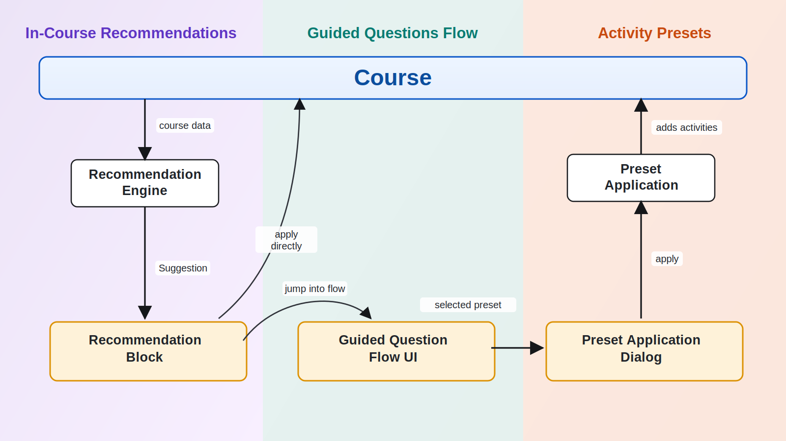
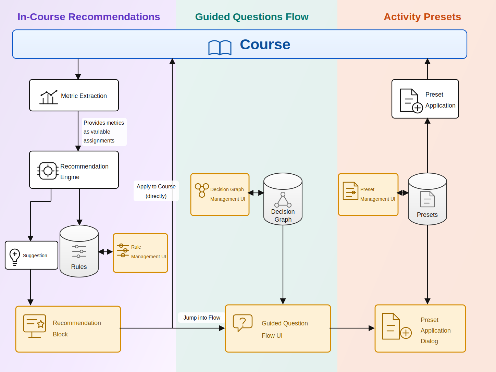

# tool_guidance - Moodle course improvement guidance

`tool_guidance` helps editing teachers decide what to add or improve in a Moodle
course. It combines course-aware suggestions, a configurable question flow, and
reusable activity presets.



The plugin provides a deterministic suggestion engine, graph-based guidance, a
teacher-facing chooser flow, and bundled addons for graph editing, starter
content, and activity preset restoration from `.mbz` backups.

Requires **Moodle 5.0 or later**. The packaged release is `0.2.0` and is marked
as alpha.

## Origin

This project originated at MoodleMoot DACH 2026 in the working group of Malte,
Lily, Jan, Martin, Stefan, Emilie, and Jason.

## What It Does

For teachers, the plugin adds a guided chooser to the Moodle activity chooser.
When a teacher clicks **Help me choose...**, they move through a
question-and-answer flow and end on one or more suggested activities or presets.

For administrators, the plugin provides configuration for:

- **Rules** define course-aware recommendations from computed course facts.
- **Guidance graphs** define the interactive question flow.
- **Presets** define reusable activity templates stored as Moodle backups.

The recommendation engine can also be used by a companion course block. This
repository provides the engine, rule management, target resolution, dismissal
handling, guided chooser, and preset application. The course block that displays
recommendations is a separate consumer.

## Main User Flows

### Help Me Choose

The course activity chooser is extended through Moodle's
`before_activitychooserbutton_exported` hook. Teachers with `tool/guidance:view`
see a **Help me choose...** action.

That action opens `admin/tool/guidance/chooser.php?courseid=<id>` and walks the
site-wide chooser entry node. The chooser is server-rendered and works as normal
page navigation; AMD JavaScript progressively enhances it into a modal/no-reload
experience.

### Course-Aware Suggestions

The suggestion engine builds a profile for the current course and evaluates the
enabled rule table in precedence order. Rules can match structural facts,
settings facts, lifecycle facts, per-module counts, and optionally engagement
facts.

The engine returns a single top suggestion. It filters out rules whose target
activity module is unavailable and rules that are dismissed for the course. It
can then let Moodle AI re-rank the remaining candidates, while deterministic
precedence remains the fallback.

Suggestions can resolve to:

- an activity creation URL,
- a node in the guidance graph,
- a known course administration page,
- or the course settings page as a safe fallback.

### Preset Application

The `guidanceaddon_preset` addon stores activity presets as single-activity
`.mbz` backups. A preset can be uploaded manually or created from an existing
course activity.

When a teacher reaches a preset result in the guided flow, the chooser restores
the selected `.mbz` into the target course section and redirects to the created
activity. If a preset reference cannot be resolved, the chooser degrades safely
instead of breaking the flow.

## Architecture

The architecture is organized around the Moodle **Course** and three connected
systems:

- **In-Course Recommendations** compute and expose course improvement
  suggestions.
- **Guided Questions Flow** leads a teacher through an interactive decision
  process.
- **Activity Presets** store and apply preconfigured Moodle activities.



### In-Course Recommendations

`classes/local/profile/profile_builder.php` extracts course facts from Moodle
APIs. The available facts are described by
`classes/local/profile/fact_catalogue.php` and wrapped in `course_profile`.

`classes/local/engine.php` evaluates enabled rules from `tool_guidance_rule`.
Rules are edited through `manage_rules.php` and `edit_rule.php`; the form uses
the condition builder UI to compile rule clauses into the condition DSL.

Dismissals are tracked per course and rule in `tool_guidance_dismissed`. Cache
invalidation is handled by course-module event observers and by rule or
dismissal writes.

### Guided Questions Flow

Guidance graphs are stored in:

- `tool_guidance_graph`
- `tool_guidance_node`
- `tool_guidance_link`

The graph model allows question nodes, leaf nodes, directed answer links,
multiple roots, and one site-wide chooser entry node. The API prevents cycles,
so the graph behaves as a DAG.

The graph editor lives in the `guidanceaddon_editor` addon. It provides the
admin graph list, graph metadata editing, and a canvas editor backed by external
web service functions.

The `guidanceaddon_starter` addon seeds a starter graph from
`addon/starter/assets/graph.json`.

### Activity Presets

The preset addon stores records in `tool_guidance_presets` and stores backup
files in the Moodle file API under `guidanceaddon_preset`.

Administrators can:

- create or edit presets,
- upload a single-activity `.mbz`,
- create a preset from an existing course activity,
- enable, disable, delete, and reorder presets.

Applying a preset uses Moodle restore APIs to restore the activity into the
current course and move it into the requested section.

## Admin Entry Points

After installation, the plugin adds a **Guidance** category under Moodle admin
tools.

Important pages:

- **Guidance settings**: AI re-ranking, dismissal cooldown, engagement facts.
- **Manage rules**: create, edit, enable, disable, delete, and reorder
  suggestion rules.
- **Manage guidance graphs**: create graphs, edit graph nodes and links, and
  choose the site-wide chooser entry node.
- **Manage activity presets**: maintain the preset library and create presets
  from existing activities.

Relevant capabilities:

- `tool/guidance:view`: use the in-course guided chooser.
- `tool/guidance:manage`: manage guidance graphs.
- `tool/guidance:managerules`: manage recommendation rules.
- `guidanceaddon/preset:manage`: manage activity presets.

## Installation

Clone or copy this repository into `admin/tool/guidance` inside a Moodle
installation:

```sh
git clone git@github.com:stefanscholz/moodle-tool_guidance.git admin/tool/guidance
```

Then visit **Site administration -> Notifications** to install or upgrade the
plugin and its addons.

## Development Notes

The repository contains the main admin tool and three bundled guidance addons:

- `addon/editor`: graph management UI.
- `addon/preset`: preset storage and application.
- `addon/starter`: starter graph seeding.

Useful code areas:

- `classes/local/engine.php`: suggestion selection.
- `classes/local/profile/`: course fact extraction.
- `classes/local/condition/`: rule condition parsing and evaluation.
- `classes/target/`: leaf target types.
- `classes/output/`: teacher-facing chooser rendering.
- `amd/src/`: progressive enhancement for chooser, chooser modal, condition
  builder, and graph editor.
- `db/seed_rules.csv`: bundled recommendation rules seeded during install.

There is a PHPUnit test suite covering rule conditions, course facts, target
resolution, graph APIs, and preset application helpers. Run it through Moodle's
normal PHPUnit setup for this plugin.

## Known Boundaries

- Preset application restores single-activity `.mbz` backups; preset parameter
  collection is not implemented in this codebase.
- The recommendation block UI is expected to be provided by a companion block or
  another consumer of `tool_guidance\local\engine`.
- AI is optional. The plugin works fully without an AI provider; AI can only
  reorder candidates already produced by deterministic rules.
